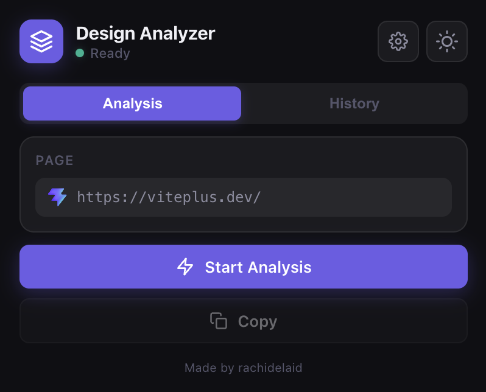
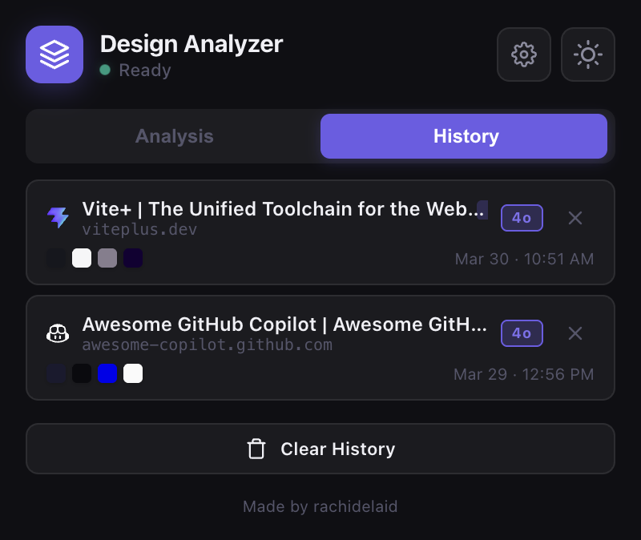

# Design Analyzer

A Chrome extension that extracts the design system of any website (colors, typography, layout, spacing, DOM structure, components) and uses OpenAI to generate a prompt you can paste into tools like v0, Bolt, or Cursor to recreate a similar site.

## Screenshots

| Analysis | History |
|---|---|
|  |  |

## Features

- **Design extraction** — automatically detects colors, fonts, layout type, grid system, spacing values, DOM structure, UI components, animations, and CSS custom properties from any page
- **AI prompt generation** — sends extracted data to OpenAI and returns a detailed, copy-ready prompt for recreating the design
- **Model selection** — choose between **GPT-4o mini** (fast, text-only) or **GPT-4o** (higher quality, includes a screenshot of the page for vision-based analysis)
- **Screenshot capture** — when using GPT-4o, the extension captures the visible tab and sends it alongside the extracted data so the AI can see gradients, images, shadows, and visual hierarchy
- **Analysis history** — stores past analyses in `chrome.storage` with one-click restore and a badge showing which model was used
- **Copy** — copy the generated prompt
- **Dark / light mode** — glassmorphism UI with theme persistence

## Project Structure

```
├── manifest.json                     # Chrome extension manifest (MV3)
├── background/                       # Service worker (ES modules)
│   ├── main.js                       # Entry point — message listener
│   ├── openai.js                     # OpenAI API client
│   ├── formatter.js                  # Design data → structured text
│   └── prompts.js                    # System prompt template
├── content/                          # Content scripts (injected into pages)
│   ├── utils.js                      # Shared utilities (rgbToHex, sampleElements)
│   ├── main.js                       # Orchestrator + message listener
│   └── extractors/                   # One file per extraction concern
│       ├── identity.js               # Brand name, hero, OG metadata
│       ├── colors.js                 # Color palette with roles
│       ├── typography.js             # Fonts, sizes, weights + font sources
│       ├── layout.js                 # Page type, grid system, container width
│       ├── sections.js               # Section detection + purpose guessing
│       ├── forms.js                  # Form fields + purpose detection
│       ├── interactions.js           # Transitions, animations, transforms
│       ├── images.js                 # Image roles + placeholder strategy
│       ├── assets.js                 # Icon library, SVGs, videos, logos
│       ├── spacing.js                # Component spacing values
│       └── meta.js                   # Responsive, CSS variables, DOM structure
├── popup/                            # Extension popup UI
│   ├── popup.html                    # Markup
│   ├── popup.css                     # Styles (glassmorphism, dark/light themes)
│   └── js/                           # Popup logic (ES modules)
│       ├── app.js                    # Entry point — wires all modules together
│       ├── state.js                  # Shared state (lastAnalysis, lastPrompt)
│       ├── utils.js                  # DOM helpers, escapeHtml, getDomain
│       ├── toast.js                  # Toast notifications
│       ├── theme.js                  # Dark/light theme toggle
│       ├── settings.js               # API key + model selection panel
│       ├── tabs.js                   # Analysis / History tab switching
│       ├── renderer.js               # Render colors, typography, layout tags
│       ├── prompt.js                 # Prompt loading/result/error UI + API call
│       ├── history.js                # History list rendering + storage
│       └── analyze.js                # Analysis orchestration + copy button
└── images/                           # Extension icons (16/32/48/128px)
```

## Setup

1. Clone the repo
2. Open `chrome://extensions` in Chrome
3. Enable **Developer mode** (top-right toggle)
4. Click **Load unpacked** and select the project folder
5. Click the extension icon, open **Settings** (gear icon), paste your OpenAI API key, and pick a model

## Usage

1. Navigate to any website you want to analyze
2. Click the Design Analyzer extension icon
3. (Optional) Open Settings to switch between GPT-4o mini and GPT-4o
4. Hit **Start Analysis**
5. The extension extracts colors, typography, layout, spacing, and DOM structure
6. OpenAI generates a recreation prompt (GPT-4o also receives a screenshot for visual context)
7. Click **Copy** to copy the prompt, then paste it into v0, Bolt, Cursor, or any AI tool

## Architecture

The codebase follows a **modular separation of concerns**:

- **Content scripts** use the manifest `js` array for ordered loading (shared global scope, no ES modules) — each extractor is independent and testable
- **Background service worker** uses ES modules (`"type": "module"`) for clean imports between API client, formatter, and prompt template
- **Popup** uses ES modules via `<script type="module">` — each UI concern (theme, settings, history, analysis) is its own module

Adding a new extractor is as simple as creating a file in `content/extractors/`, defining the function, adding it to the manifest's `js` array, and calling it from `content/main.js`.

## What Gets Extracted

| Category | Details |
|---|---|
| Colors | Background, text, border, and accent colors (up to 12, filtered for relevance) |
| Typography | Font families, sizes, weights, line-heights for H1, H2, and body text |
| Layout | Page type, navigation presence, section count, grid system (grid/flexbox/block) |
| Spacing | Padding, margin, and gap values sampled from containers |
| Components | Hero, cards, forms, testimonials, pricing, gallery, footer, navigation |
| Interactions | CSS transitions, animations, and transforms |
| DOM Structure | Simplified HTML skeleton (tags, classes, roles) up to 4 levels deep |
| CSS Variables | All custom properties discovered across stylesheets |
| Responsive | Viewport meta tag and media query detection |

## Permissions

| Permission | Reason |
|---|---|
| `activeTab` | Access the current tab's URL, content, and capture screenshots |
| `scripting` | Inject the content script on demand |
| `clipboardWrite` | Copy colors and prompts to clipboard |
| `storage` | Persist API key, model choice, history, and theme preference |
| `host_permissions: <all_urls>` | Run the content script on any website |

## Tech Stack

- Chrome Extension Manifest V3
- Vanilla JS / CSS (no frameworks, no CDN dependencies)
- OpenAI Chat Completions API (GPT-4o mini or GPT-4o with vision)

## Author

Made by rachidelaid
